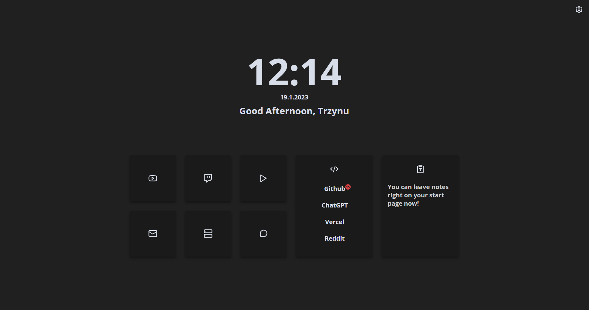

### PixelPage
Simple and minimalistic start page with some unique features.

### Usage
1. Clone the repository and unpack it
2. Download the [Custom New Tab URL](https://chrome.google.com/webstore/detail/custom-new-tab-url/mmjbdbjnoablegbkcklggeknkfcjkjia) chrome extension.
3. change the link option in the extension to the index.html file.

You can change all settings either in the settings.js file or on-site settings.

### Planned features
- ✓ ~~on-site settings~~
- ✓ ~~github notification count~~
- searchbar
- weather
- reminders

Feel free to request any features you want to see.

Tis project is inspired by [Bento by migueravila](https://github.com/migueravila/Bento#-usage)
